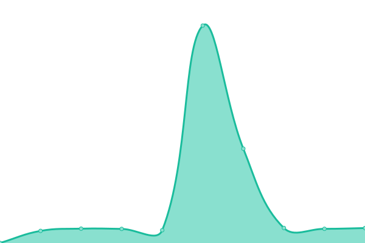

# [📈 Live Status](https://uptime.xcpcio.com): <!--live status--> **🟩 All systems operational**

This repository contains the open-source uptime monitor and status page for [XCPCIO](https://xcpcio.com), powered by [Upptime](https://github.com/upptime/upptime).

With [Upptime](https://upptime.js.org), you can get your own unlimited and free uptime monitor and status page, powered entirely by a GitHub repository. We use [Issues](https://github.com/XCPCIO/uptime/issues) as incident reports, [Actions](https://github.com/XCPCIO/uptime/actions) as uptime monitors, and [Pages](https://uptime.xcpcio.com) for the status page.

<!--start: status pages-->
<!-- This summary is generated by Upptime (https://github.com/upptime/upptime) -->
<!-- Do not edit this manually, your changes will be overwritten -->
<!-- prettier-ignore -->
| URL | Status | History | Response Time | Uptime |
| --- | ------ | ------- | ------------- | ------ |
|  [XCPCIO](https://xcpcio.com) | 🟩 Up | [xcpcio.yml](https://github.com/XCPCIO/uptime/commits/HEAD/history/xcpcio.yml) | 

 1657ms
     
 | 

<a href="https://uptime.xcpcio.com/history/xcpcio">99.50%</a>
    

|  [XCPCIO Github Mirror](https://gh.xcpcio.com) | 🟩 Up | [xcpcio-github-mirror.yml](https://github.com/XCPCIO/uptime/commits/HEAD/history/xcpcio-github-mirror.yml) | 

 675ms
     
 | 

<a href="https://uptime.xcpcio.com/history/xcpcio-github-mirror">100.00%</a>
    

|  [Board](https://board.xcpcio.com) | 🟩 Up | [board.yml](https://github.com/XCPCIO/uptime/commits/HEAD/history/board.yml) | 

 1298ms
     
 | 

<a href="https://uptime.xcpcio.com/history/board">99.74%</a>
    

|  [Rating](https://rating.xcpcio.com) | 🟩 Up | [rating.yml](https://github.com/XCPCIO/uptime/commits/HEAD/history/rating.yml) | 

 494ms
     
 | 

<a href="https://uptime.xcpcio.com/history/rating">100.00%</a>
    

|  [Codeforces Analytics](https://codeforces.analytics.xcpcio.com) | 🟩 Up | [codeforces-analytics.yml](https://github.com/XCPCIO/uptime/commits/HEAD/history/codeforces-analytics.yml) | 

 538ms
     
 | 

<a href="https://uptime.xcpcio.com/history/codeforces-analytics">100.00%</a>
    

|  [ShowCode](https://showcode.xcpcio.com) | 🟩 Up | [show-code.yml](https://github.com/XCPCIO/uptime/commits/HEAD/history/show-code.yml) | 

 311ms
     
 | 

<a href="https://uptime.xcpcio.com/history/show-code">100.00%</a>
    

|  [University Information](https://university.xcpcio.com) | 🟩 Up | [university-information.yml](https://github.com/XCPCIO/uptime/commits/HEAD/history/university-information.yml) | 

 451ms
     
 | 

<a href="https://uptime.xcpcio.com/history/university-information">100.00%</a>
    

|  [BZPRO](https://bzpro.xcpcio.com) | 🟩 Up | [bzpro.yml](https://github.com/XCPCIO/uptime/commits/HEAD/history/bzpro.yml) | 

 525ms
     
 | 

<a href="https://uptime.xcpcio.com/history/bzpro">100.00%</a>
    

<!--end: status pages-->

[**Visit our status website →**](https://uptime.xcpcio.com)

## 📄 License

- Powered by: [Upptime](https://github.com/upptime/upptime)
- Code: [MIT](./LICENSE) © [XCPCIO](https://xcpcio.com)
- Data in the `./history` directory: [Open Database License](https://opendatacommons.org/licenses/odbl/1-0/)
